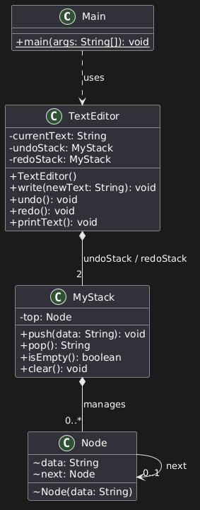

# Simple Text Editor

A lightweight console-based text editor built in Java that implements **Undo** and **Redo** operations using custom stack data structures.

---

## Features

- **Text Operations:** Append text smoothly with automatic whitespace separation.
- **Undo / Redo:** Full support for reverting and reapplying changes using a custom linked-list stack implementation.
- **Memory Optimized:** Utilizes `StringBuilder` to minimize string allocations and garbage collection overhead.
- **Command Shortcuts:** Quick shortcuts for common operations (`:z` for undo, `:y` for redo).

---

## Architecture & Data Structures

- **`Node`**: Basic node element holding text data and a reference to the next node.
- **`MyStack`**: Custom stack implementation based on a singly linked list providing $O(1)$ `push` and `pop` operations.
- **`TextEditor`**: Manages the current editor state using `StringBuilder` alongside an `undoStack` and `redoStack`.
- **`Main`**: Console interface and command interpreter.

### UML Diagram


---

## Available Commands

| Command | Shortcut | Description |
| :--- | :---: | :--- |
| `write <text>` | — | Appends `<text>` to the editor buffer |
| `undo` | `:z` | Reverts the last write operation |
| `redo` | `:y` | Restores the previously undone operation |
| `exit` | — | Terminates the application |

---

## Getting Started

### Prerequisites
- Java Development Kit (JDK 8 or higher)

### Compilation & Running
1. Clone the repository:
   ```bash
   git clone [https://github.com/mohammed1elmaghraby/Simple-Text-Editor.git](https://github.com/mohammed1elmaghraby/Simple-Text-Editor.git)
   cd Simple-Text-Editor
   ```

   ### Author
        Mohammed Elmaghraby

   
